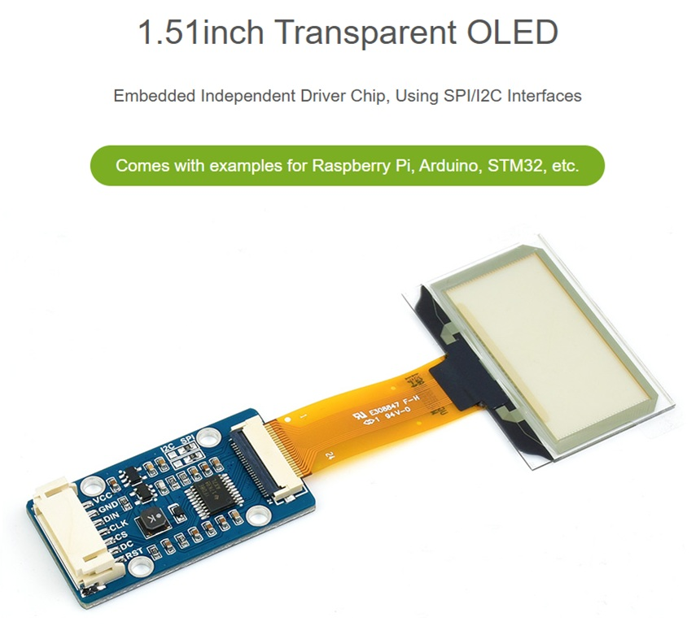
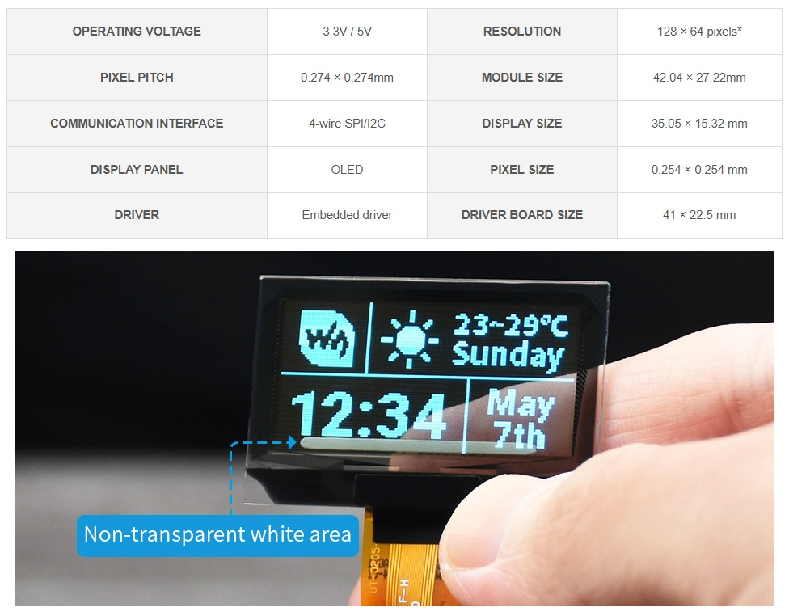
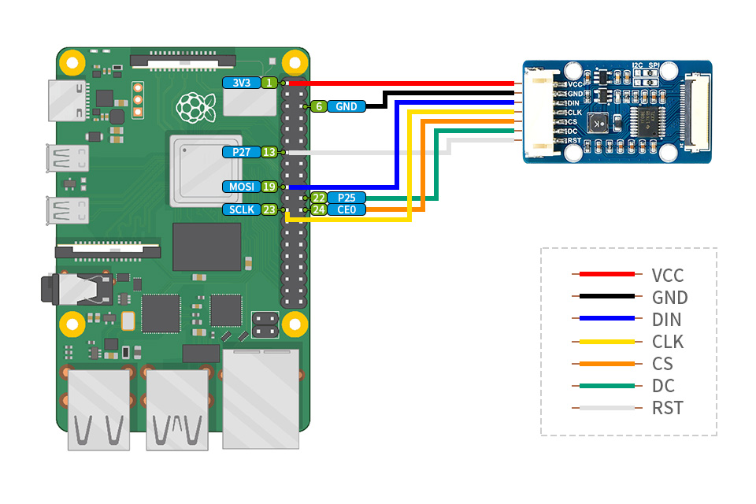
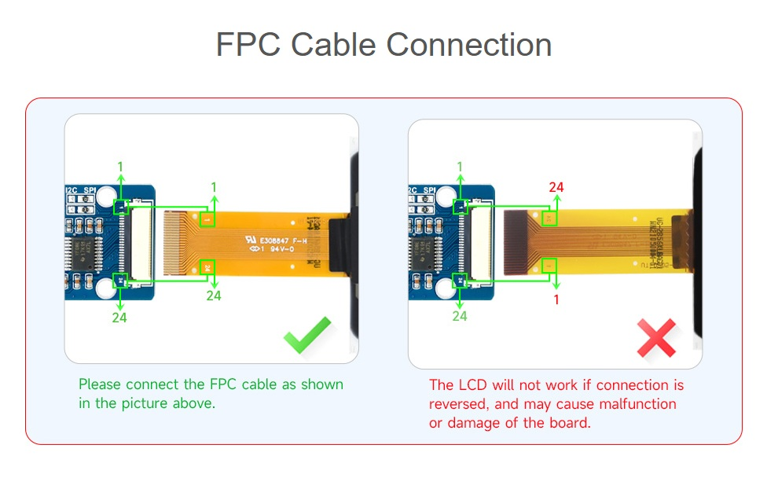
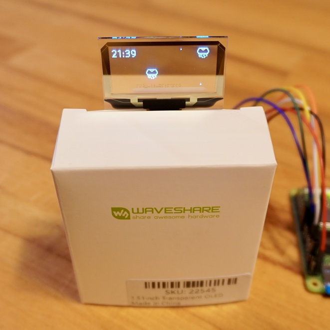

<a name="readme-top"></a>

<!-- ABOUT THE PROJECT -->

# 1. プロジェクトについて

Raspberry Pi の 4-wire SPI を使って 1.51 インチの透明 OLED「1.51inch Transparent OLED」へ画像を表示するプロジェクトです。




Waveshare から提供されているサンプルコード「OLED_1in51_test.py」をベースに作成しています。

https://files.waveshare.com/upload/2/2c/OLED_Module_Code.7z

サンプルコードのパスは以下です。環境構築後に実行すればテストが実行されます。

```
OLED_Module_Code/RaspberryPi/python/example/OLED_1in51_test.py
```

<p align="right">(<a href="#readme-top">back to top</a>)</p>

# 2. 環境構築

公式の Raspberry Pi の環境構築手順は以下に記載されています。

- [1.51inch Transparent OLED](https://www.waveshare.com/wiki/1.51inch_Transparent_OLED)

とりあえず実行したい場合は、ターミナルを起動して下記のコマンドを順に入力ください。

## 2.1. 配線図




## 2.2. ライブラリインストール

SPI Interface を有効にします。

```Shell
$ sudo raspi-config
Choose Interfacing Options -> SPI -> Yes Enable SPI interface
$ sudo reboot
```

ライブラリをインストールします。 OS が bookworm であれば lgpio ライブラリのみです。

```Shell
$ cat /etc/os-release
```

「VERSION="12 (bookworm)"」であれば bookworm です。  
lgpio をインストール。

```Shell
$ wget https://github.com/joan2937/lg/archive/master.zip
$ unzip master.zip
$ cd lg-master
$ sudo make install
```

Python のライブラリをインストール。

```Shell
$ sudo apt-get update
$ sudo apt-get install python3-pip
$ sudo apt-get install python3-pil
$ sudo apt-get install python3-numpy
$ sudo apt install python3-spidev
$ sudo apt-get install python3-smbus
```

プログラムを実行します。

1. 「sample」フォルダを任意のフォルダへコピー
2. 「sample/example」へ移動
3. 公式のサンプルプログラムを実行
   1. `$ python3 OLED_1in51_test.py`
4. クラゲ画像を表示
   1. `$ python3 OLED_1in51_jellyfish.py`

<p align="right">(<a href="#readme-top">back to top</a>)</p>

# 3. 参考

透明 OLED についてもっと知りたい方、他の設定も知りたい方は Manual を参照ください。

- [Raspberry Pi Getting started](https://www.raspberrypi.com/documentation/computers/getting-started.html)
- [1.51inch Transparent OLED](https://www.waveshare.com/1.51inch-transparent-oled.htm)
- [1.51inch Transparent OLED Manual](https://www.waveshare.com/wiki/1.51inch_Transparent_OLED)

<p align="right">(<a href="#readme-top">back to top</a>)</p>

# 4. 画像



<p align="right">(<a href="#readme-top">back to top</a>)</p>
