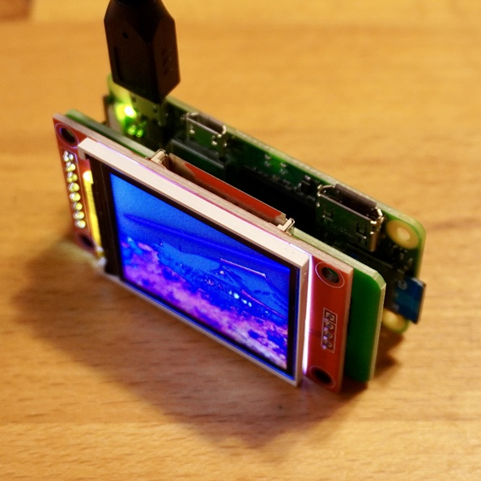
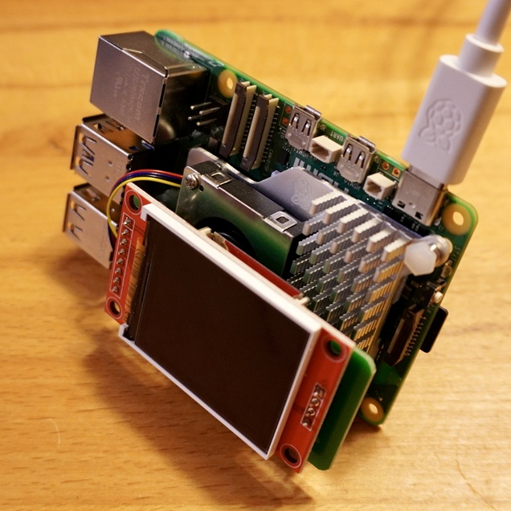
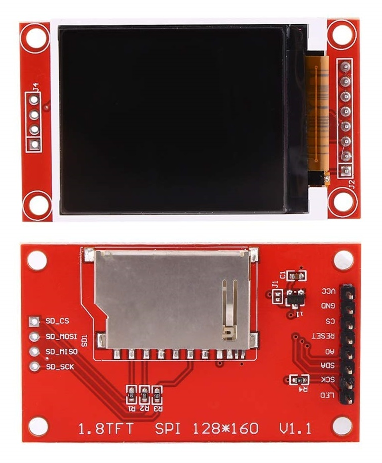
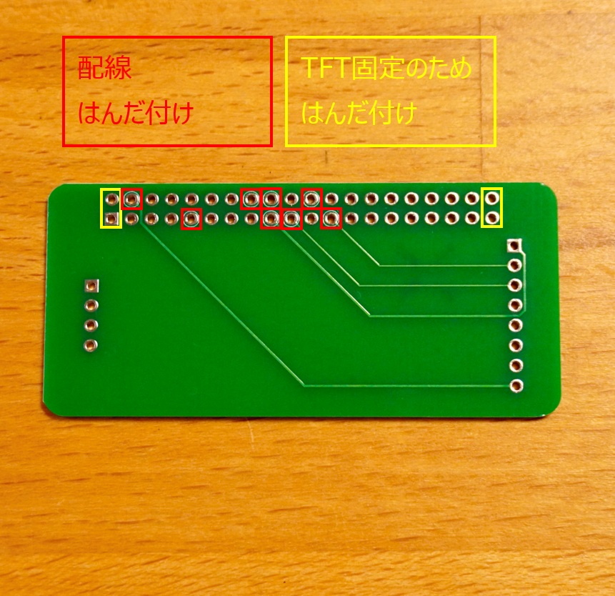
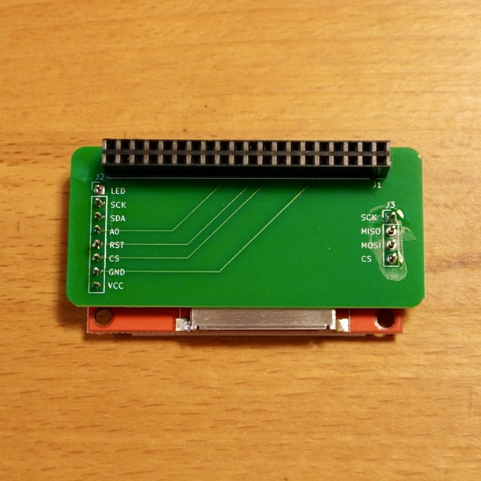
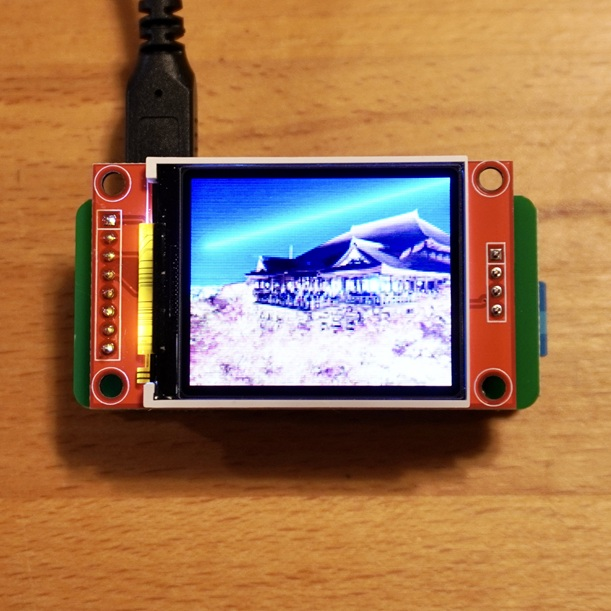

<a name="readme-top"></a>

<!-- ABOUT THE PROJECT -->

# 1. プロジェクトについて

Raspberry Pi の GPIO を使って TFT 液晶ディスプレイ（ST7735）へ表示するプロジェクトです。  
Raspberry Pi や Raspberry Pi Zero に取り付けることのできる Raspberry Pi HAT を作成します。  
プリント基板と液晶ディスプレイをはんだ付けすれば、Raspberry Pi の GPIO ピンヘッダに挿すことで、配線無しで液晶ディスプレイを使用できます。

写真は、Raspberry Pi Zero 2 W に液晶ディスプレイを取り付けています。Raspberry Pi にも使用できます。




本プロジェクトでサポートしているパネルです。

- [adafruit Python Usage](https://learn.adafruit.com/1-8-tft-display/python-usage)
  | ST7735 128x160 |
  | ------------------------------------------------- |
  |  |

<p align="right">(<a href="#readme-top">back to top</a>)</p>

# 2. Pin connections

はんだ付けをする前に、必ず仮組みをして、ピンやはんだ付けする箇所を確認ください。

## 2.1. ピンソケットのはんだ付け

ピンソケット 2×20 は、配線の赤の 8 箇所と、ピンソケットを固定するための黄色の 4 箇所をはんだ付けしてください。  
液晶ディスプレイをはんだ付けした後、液晶ディスプレイは外せないため間違うと戻せません。



## 2.2. 液晶ディスプレイのはんだ付け

次に液晶ディスプレイをはんだ付けしてください。  
左のピンは 8 箇所全て、右は上下 2 箇所で良いです。  
（右は液晶ディスプレイ固定のためで、どこにもつながっていません）



## 2.3. プリント基板の配線

プログラムで使用しています。

| TFT       | RasPi | No  |
| --------- | ----- | --- |
| LED       | 3V3   |     |
| SCK       | GP11  | 23  |
| SDI(MOSI) | GP10  | 19  |
| DC        | GP25  | 22  |
| RESET     | GP24  | 18  |
| CS        | GP23  | 24  |
| GND       | GND   |     |
| VCC       | 3V3   |     |

<p align="right">(<a href="#readme-top">back to top</a>)</p>

# 3. 環境構築

## 3.1. 仮想環境へ Adafruit ライブラリインストール

```Shell
$ sudo apt update
$ sudo apt upgrade
$ sudo apt install python3-pip
$ sudo apt install python3-venv
$ python3 -m venv venv
$ source venv/bin/activate
$ pip install adafruit-circuitpython-rgb-display adafruit-blinka
$ pip install pillow
```

## 3.2. プログラムの実行

1. 適当なフォルダへ main.py と image フォルダをコピー
1. > $ python main.py
1. "Hello World"が表示され、画像が表示されれば成功

次回実行時には仮想環境を有効にして実行ください。

> $ source venv/bin/activate

<p align="right">(<a href="#readme-top">back to top</a>)</p>

# 4. 参考

- [Raspberry Pi hardware](https://www.raspberrypi.com/documentation/computers/raspberry-pi.html)
- [adafruit Python Wiring and Setup](https://learn.adafruit.com/1-8-tft-display/python-wiring-and-setup)
- [adafruit Python Usage](https://learn.adafruit.com/1-8-tft-display/python-usage)
- [RaspberryPi で 1.8" TFT 液晶へ画像を表示](https://qiita.com/wy0727_betch/items/1da0208120adb98f7981)

## 4.1. 画像



<p align="right">(<a href="#readme-top">back to top</a>)</p>
