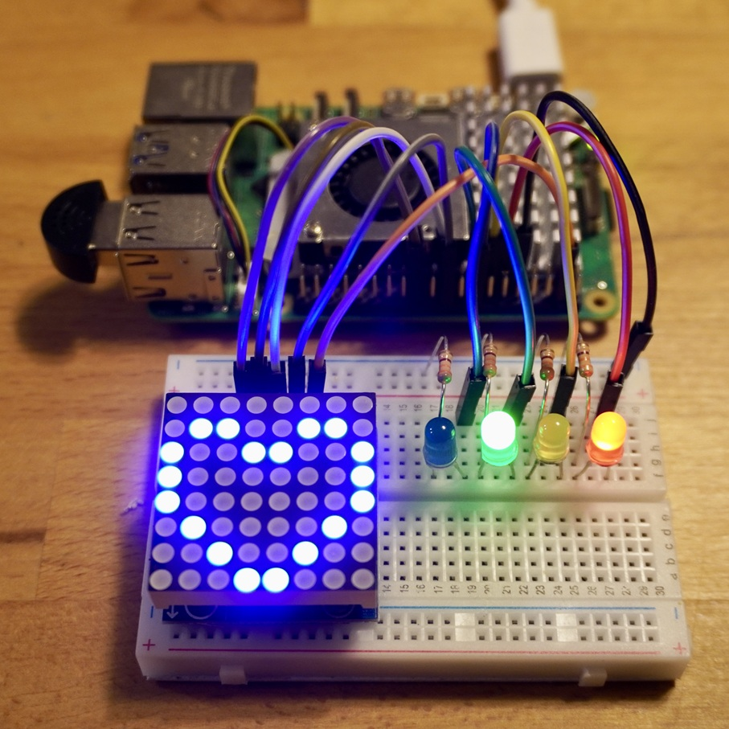
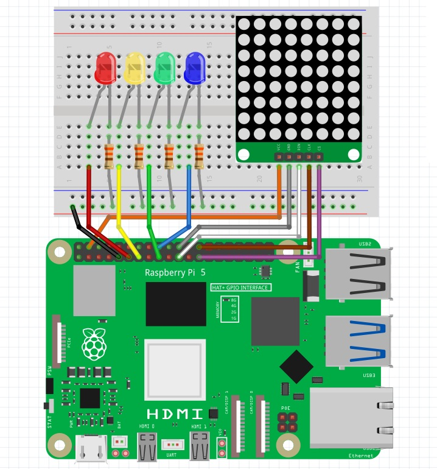
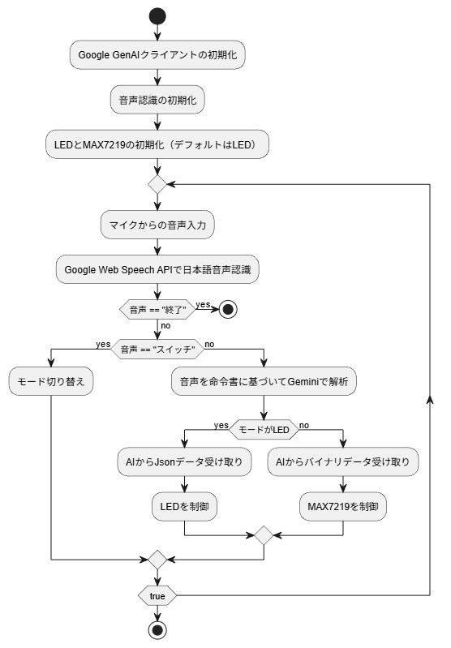

<a name="readme-top"></a>

# 1. プロジェクトについて

Raspberry Pi でAIを使って LED や MAX7219(8x8LEDマトリクス) を制御するプロジェクトです。  
USBマイクから音声を入力し、その音声を Google 音声認識でテキストへ変換、次に Google GenAI を使ってテキストを解析した結果をもとに LED や MAX7219 を動かします。  



## 1.1. 注意事項

- 本動作確認は、Raspberry Pi 5 で行っています。これ以外は未検証です。  
- **2026/05/17** 時点の情報のため、使用できるライブラリ、インストール方法、APIキーの作成方法など、異なる場合がございます。適宜ご確認ください。
- Google AI Studio の無料のAPIキーには利用上限があります。詳しくは最下段の「APIの料金」を参照ください。

<p align="right">(<a href="#readme-top">back to top</a>)</p>

# 2. Pin connections



| LED | RPi GPIO |     | MAX7219 | RPi GPIO          |
| --- | -------- | --- | ------- | ----------------- |
| 赤  | GPIO 17  |     | VCC     | 3.3V              |
| 黄  | GPIO 27  |     | GND     | GND               |
| 緑  | GPIO 22  |     | MOSI    | GPIO 10(SPI MOSI) |
| 青D | GPIO 23  |     | CS      | GPIO 8(SPI CE0)   |
|     |          |     | CLK     | GPIO 11(SPI SCLK) |

<p align="right">(<a href="#readme-top">back to top</a>)</p>

# 3. ファイル構成

- `main.py` - メイン実行ファイル
- `matrix.py` - MAX7219 制御クラス
- `system_led_rules.md` - LED 用システム指示
- `system_dot_rules.md` - MAX7219用システム指示

<p align="right">(<a href="#readme-top">back to top</a>)</p>

# 4. 環境構築

Raspberry Pi 5 は、OS管理のPythonと、ユーザーが使用するライブラリの競合を防ぐために`pip install`を使用して直接インストールができません。  
そのため仮想環境を作成して、そこへ必要なライブラリをインストールします。

## 4.1. 仮想環境構築

venvで作成し、sourceで有効にします。仮想環境についてはネットで確認ください。  
本環境をコピーしたフォルダで実行してください。

```bash
python3 -m venv venv
source venv/bin/activate
```

## 4.2. ライブラリインストール

```bash
pip install google-genai
pip install SpeechRecognition
pip install pyaudio
pip install gpiozero
pip install spidev
pip install pillow
```
もし動作時にエラーが出たら、同じようにインストールしてください。

## 4.3. Google AI Studio APIキー の作成

1. Google AI Studioにアクセスし、Googleアカウントでログインします。
1. 左側のメニューから [Get API key] をクリックします。
1. [Create API key]（新規プロジェクトで作成）をクリックし、生成されたキーをコピーします。

<p align="right">(<a href="#readme-top">back to top</a>)</p>

# 5. プログラムの実行

1. 本環境を適当なフォルダへコピー
2. 必要なライブラリをインストール
3. Google GenAI SDKのAPIキーを取得
4. `main.py`の`YOUR_API_KEY`に設定
5. > $ python main.py
6. **"音声入力を待機しています..."** と表示され音声入力待ちになります

デフォルトのAIのモデルは下記です。`main.py`の`MODEL_ID`です。適宜変更ください。
>MODEL_ID = "models/gemini-2.5-flash"

プログラムには次のモードがあります。

- `LED`：LEDを制御するモード
- `DOT`：MAX7219を制御するモード

起動時はLEDです。 **"スイッチ"** と言うたびにモードが切り替わります。
**"終了"** でプログラム終了です。

## 5.1. LED：LEDを制御するモード

プログラムで次のステータスを処理していますので、「緑を点灯、青を点滅」「赤を3回点滅して」などと話しかけてください。  
「全て消して」などもAIが判断して制御可能です。

  - `color`: 「赤」「青」「緑」「黄」
  - `status`: 「点灯」「消灯」「点滅」
  - `number`: 回数

**system_led_rules.md** を変更することでカスタマイズできます。

## 5.2. DOT：MAX7219を制御するモード

「丸を描いて」「アルファベットのBを表示して」と話しかけると、MAX7219に表示されます。  
音声入力をAIが理解できて、8x8のドット絵を作成できれば表示されます。適当に話しかけてみてください。

**system_dot_rules.md** を変更することでカスタマイズできます。

<p align="right">(<a href="#readme-top">back to top</a>)</p>

# 6. 参考

- [Raspberry Pi 5](https://www.raspberrypi.com/products/raspberry-pi-5/)
- [Google AI Studio](https://aistudio.google.com/)
- [Gemini Developer API の料金](https://ai.google.dev/gemini-api/docs/pricing?hl=ja)
- docs/max7219_max7221_j.pdf：MAX7219の説明書


## 6.1. アクティビティ図



<p align="right">(<a href="#readme-top">back to top</a>)</p>

