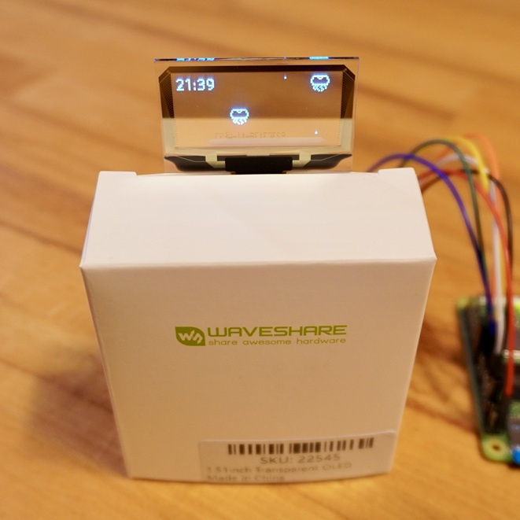
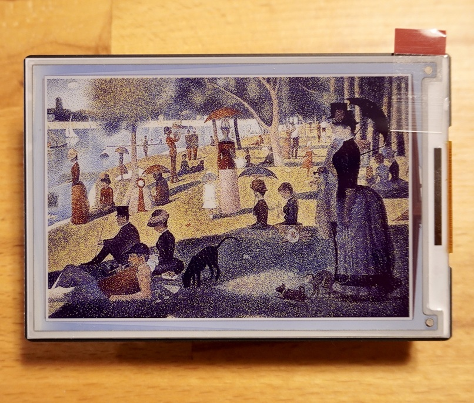
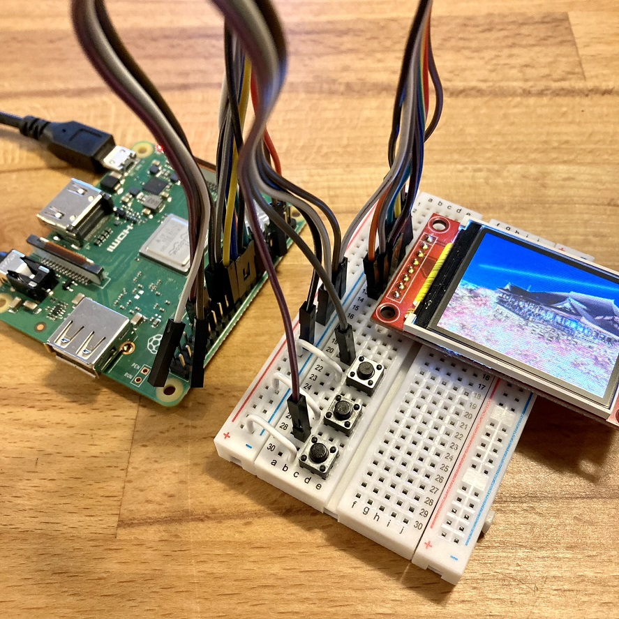
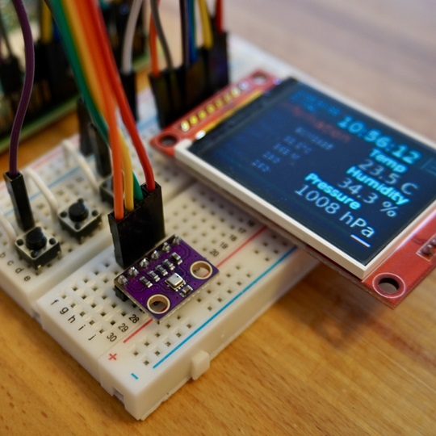
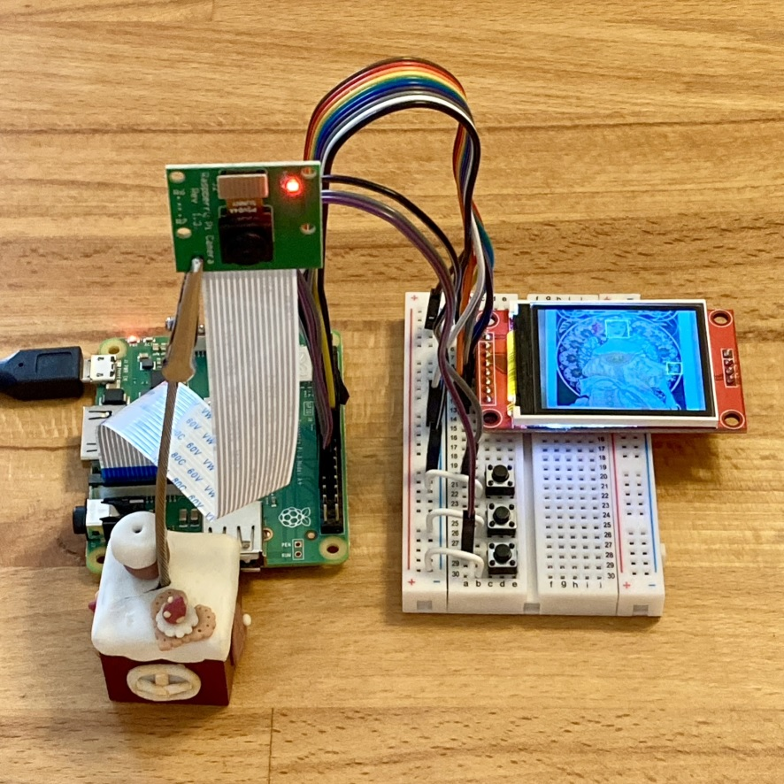
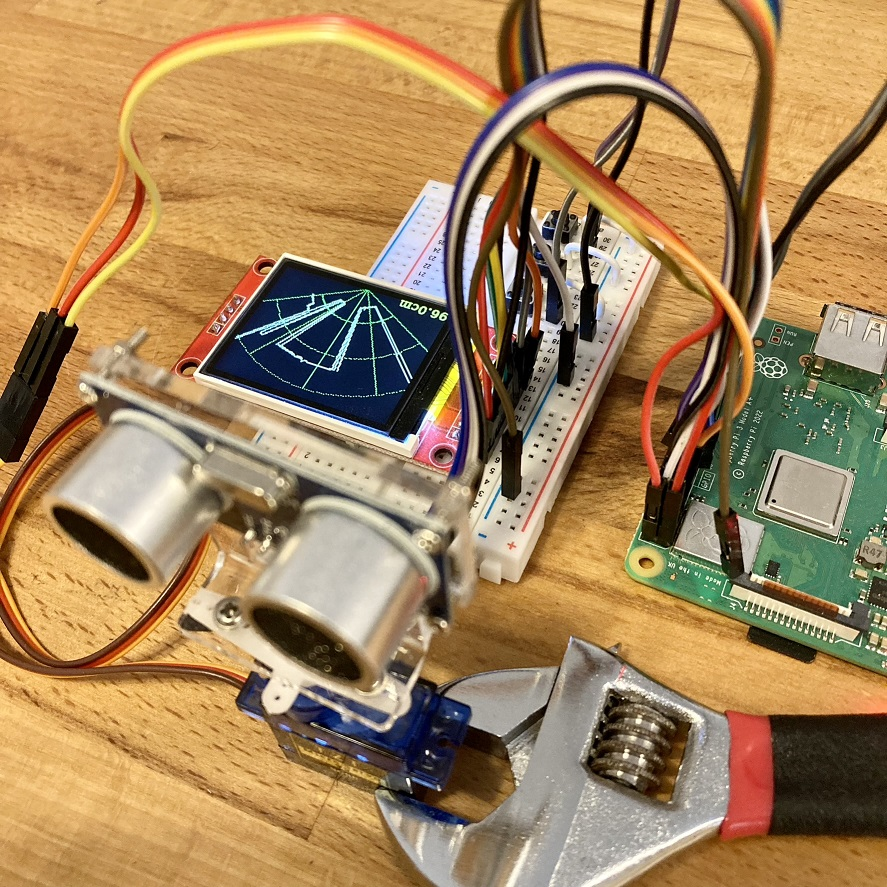

<!-- ABOUT THE PROJECT -->

# 1. プロジェクトについて

Raspberry Pi を対象としたプロジェクトです。  
ここでは、実際に Raspberry Pi で作成したプログラムを展開します。

(<a href="#readme-top">back to top</a>)

<!-- USAGE EXAMPLES -->

# 2. GPIO and the 40-pin Header

(<a href="#readme-top">back to top</a>)

# 3. プロジェクト

Raspberry Pi を使ったプログラムを置いています。各プロジェクトにて詳細確認ください。

- 1in51-Transparent-OLED : 1.51 インチの透明 OLED を使ったプロジェクト
- ePaper : 電子ペーパーを使ったプロジェクト
- ePaper-4inch : 4 インチフルカラーの電子ペーパーを使ったプロジェクト
- ST7735 : 1.8 TFT ST7735 128x160 を使ったプロジェクト
- ST7735-BM280 : TFT と温湿度・気圧センサモジュールを使ったプロジェクト
- ST7735-Camera : TFT とカメラモジュールを使ったプロジェクト
- ST7735-HCSR04 : TFT と超音波距離センサー、サーボモーターを使ったプロジェクト

(<a href="#readme-top">back to top</a>)

# 4. 参考

- [Raspberry Pi hardware](https://www.raspberrypi.com/documentation/computers/raspberry-pi.html)

## 4.1. 写真

(<a href="#readme-top">back to top</a>)

