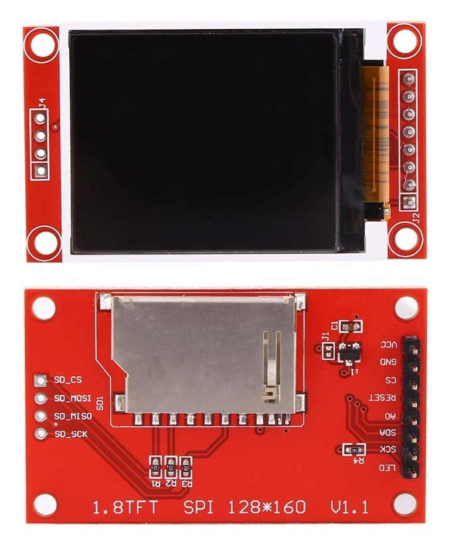

<a name="readme-top"></a>

<!-- ABOUT THE PROJECT -->

# 1. プロジェクトについて

Raspberry Pi の GPIO を使って TFT 液晶ディスプレイ（ST7735）へ表示するプロジェクトです。  
高精度なボッシュ社の BME280 を搭載したセンサモジュールで、  
温度、湿度、気圧の 3 つの環境情報を同時に測定し、ディスプレイへ測定値を表示します。  
マイコンとの通信方式は I2C を使用しています。  
ディスプレイへの表示と BME280 の使い方は adafruit のコードを参考に作成しています。ありがとう

- [adafruit Python Usage](https://learn.adafruit.com/1-8-tft-display/python-usage)
- [Adafruit_CircuitPython_BME280](https://github.com/adafruit/Adafruit_CircuitPython_BME280)


  


本プロジェクトでは以下のパネルをサポートしています。

| ST7735 128x160                                    |
| ------------------------------------------------- |
|  |

<p align="right">(<a href="#readme-top">back to top</a>)</p>

# 2. Pin connections

※BME280 のはんだ付けは短時間で実施ください。長時間高熱にすると壊れます。

- CLK は SPI クロックに接続します。Raspberry Pi では、SLCK です。
- MOSI は SPI MOSI に接続します。Raspberry Pi では、MOSI です。
- CS は SPI チップセレクトピンに接続します。CE0 を使用します。
- D/C は SPI チップセレクトピンに接続します。GPIO 25 を使用しますが、後で変更できます。
- RST はリセットピンに接続します。GPIO 24 を使用しますが、後で変更できます。
- Vin は Raspberry Pi の 3V ピンに接続します。
- GND は Raspberry Pi のグラウンドに接続します。


| TFT       | RasPi |     | BTN | RasPi |
| --------- | ----- | --- | --- | ----- |
| LED       | 3V3   |     | A   | GP5   |
| SCK       | GP11  |     | B   | -     |
| SDI(MOSI) | GP10  |     | C   | GP6   |
| DC        | GP25  |     | GND | GND   |
| RESET     | GP24  |     |     |       |
| CS        | GP8   |     |     |       |
| GND       | GND   |     |     |       |
| VCC       | 5V    |     |     |       |


| BME280 | RasPi |
| ------ | ----- |
| VCC    | 3V3   |
| GND    | GND   |
| SCL    | GP3   |
| SDA    | GP2   |

<p align="right">(<a href="#readme-top">back to top</a>)</p>

# 3. 環境構築

## 3.1. Adafruit ライブラリインストール

```Shell
$ sudo apt update
$ sudo apt upgrade
$ sudo apt install python3-pip
$ sudo pip3 install adafruit-circuitpython-rgb-display
$ sudo apt install python3-pil
$ sudo pip3 install adafruit-circuitpython-bme280
```

インストールしたライブラリの確認。

```Shell
$ python
>>>import PIL
>>>import adafruit_rgb_display
>>>from adafruit_bme280 import basic as adafruit_bme280
```

エラーが出なければ完了です。  
配線後 bme280_test.py で BME280 のテストができます。

## 3.2. プログラムの実行

1. 適当なフォルダへ main.py と image フォルダをコピー
1. > $ python main.py
1. BME280 から取得した値が 1 秒置きに表示されます

# 4. 参考

- [Raspberry Pi hardware](https://www.raspberrypi.com/documentation/computers/raspberry-pi.html)
- [adafruit Python Wiring and Setup](https://learn.adafruit.com/1-8-tft-display/python-wiring-and-setup)
- [adafruit Python Usage](https://learn.adafruit.com/1-8-tft-display/python-usage)
- [RaspberryPi で 1.8" TFT 液晶へ画像を表示](https://qiita.com/wy0727_betch/items/1da0208120adb98f7981)
- [Humidity sensor BME280](https://www.bosch-sensortec.com/products/environmental-sensors/humidity-sensors-bme280/)
- [Adafruit_CircuitPython_BME280](https://github.com/adafruit/Adafruit_CircuitPython_BME280)
- [BME280 で環境測定](https://robofarm.jp/ProMicrobit/sensor/BME280no01.html)

## 4.1. 画像


<p align="right">(<a href="#readme-top">back to top</a>)</p>
