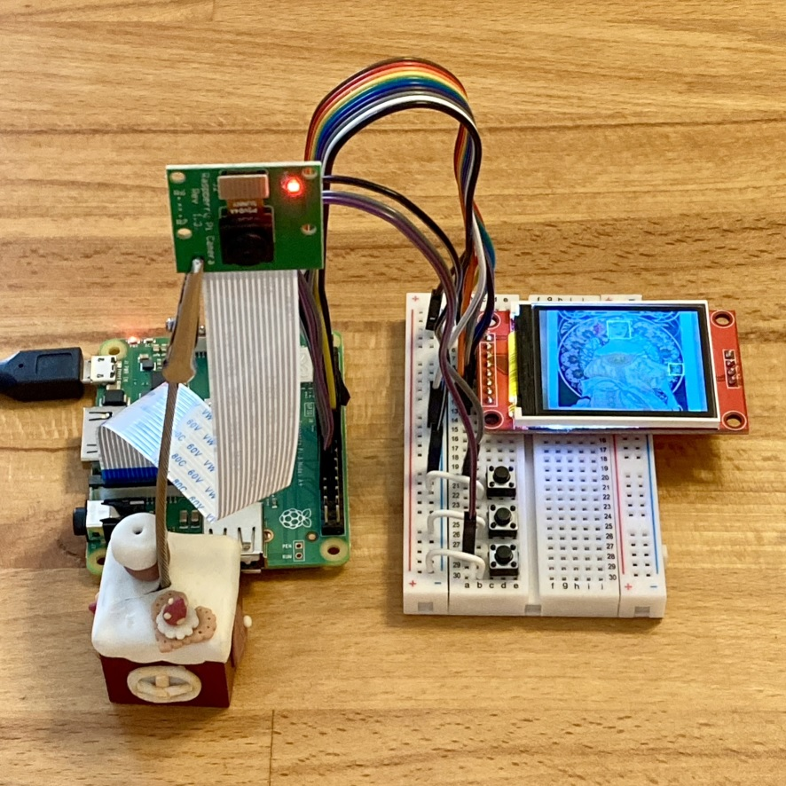
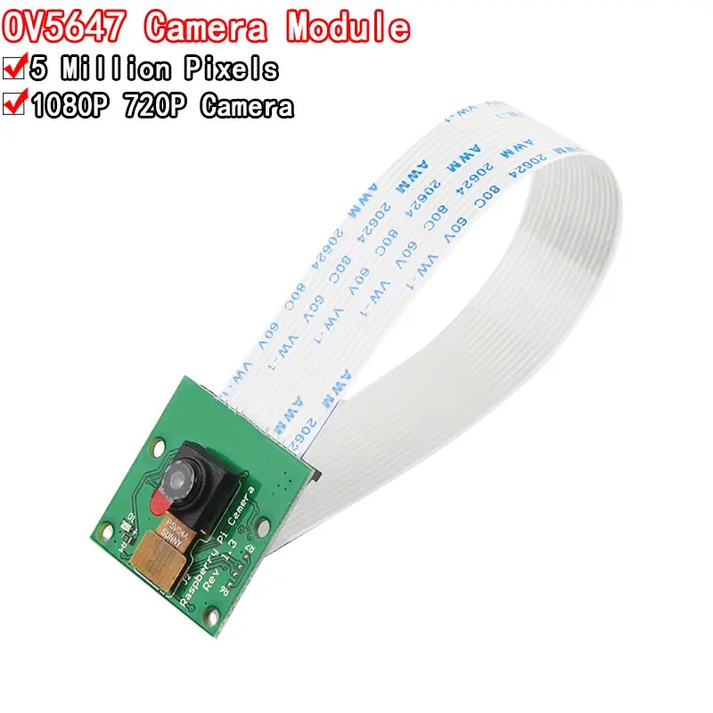
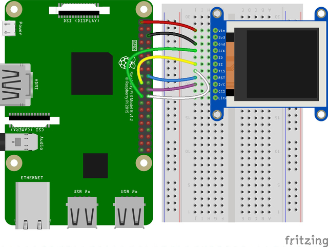
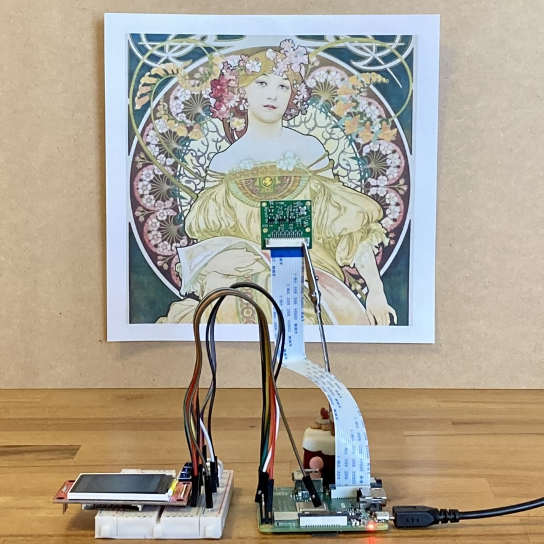

<a name="readme-top"></a>

<!-- ABOUT THE PROJECT -->

# 1. プロジェクトについて

Raspberry Pi の GPIO を使って TFT 液晶ディスプレイ（ST7735）へ表示するプロジェクトです。  
カメラモジュールで撮影をしながら、ディスプレイへ画像を表示します。  
A ボタンを押すと画像撮影の開始終了、C ボタンを押すと顔認識の開始終了を行います。  
adafruit の「1.8" TFT Display Breakout and Shield / Python Usage」のコードを参考に作成しています。  
参照元のページは下段の「adafruit Python Usage」から確認できます。




本プロジェクトでは以下のパネルをサポートしています。

| ST7735 128x160                                    |
| ------------------------------------------------- |
|  |

<p align="right">(<a href="#readme-top">back to top</a>)</p>

# 2. Pin connections

- CLK は SPI クロックに接続します。Raspberry Pi では、SLCK です。
- MOSI は SPI MOSI に接続します。Raspberry Pi では、MOSI です。
- CS は SPI チップセレクトピンに接続します。CE0 を使用します。
- D/C は SPI チップセレクトピンに接続します。GPIO 25 を使用しますが、後で変更できます。
- RST はリセットピンに接続します。GPIO 24 を使用しますが、後で変更できます。
- Vin は Raspberry Pi の 3V ピンに接続します。
- GND は Raspberry Pi のグラウンドに接続します。



| TFT       | RasPi |     | BTN | RasPi |
| --------- | ----- | --- | --- | ----- |
| LED       | 3V3   |     | A   | GP5   |
| SCK       | GP11  |     | B   | -     |
| SDI(MOSI) | GP10  |     | C   | GP6   |
| DC        | GP25  |     | GND | GND   |
| RESET     | GP24  |     |     |       |
| CS        | GP8   |     |     |       |
| GND       | GND   |     |     |       |
| VCC       | 3V3   |     |     |       |

<p align="right">(<a href="#readme-top">back to top</a>)</p>

# 3. 環境構築

## 3.1. Adafruit ライブラリインストール

```Shell
sudo apt update
sudo apt upgrade
sudo apt install python3-pip
sudo pip3 install adafruit-circuitpython-rgb-display
sudo apt install python3-pil
```

インストールしたライブラリの確認。

```Shell
$ python
>>>import PIL
>>>import adafruit_rgb_display
```

エラーが出なければ完了です。

## 3.2. PiCamera ライブラリインストール

- [カメラモジュールを始めよう](https://projects.raspberrypi.org/ja-JP/projects/getting-started-with-picamera)

- [カメラハードウェアのセットアップ](https://igarashi-systems.com/sample/translation/raspberry-pi/configuration/config-camera.html)

## 3.3. OpenCv ライブラリインストール

```Shell
sudo apt update
sudo apt upgrade
sudo pip install --upgrade pip
sudo pip install opencv-python==4.5.1.48
```

ビルド済みの OpenCv を使用するためバージョン指定しています。バージョン指定しない場合はビルドもするため時間がかかります。  
インストールしたライブラリの確認。

```Shell
$ python
>>>import cv2
```

エラーがでなければ cv_test.py を実行し captured.jpg が保存されればカメラと OpenCv の設定は完了です。  
但し、CUI 環境の場合はライブラリが足りず恐らく以下のようなエラーがたくさんでます。

```Shell
ImportError: libIlmImf-2_5.so.25: cannot open shared object file: No such file or directory
```

エラー内容に合わせて以下をインストールください。
上記エラーは libopenexr25 のインストールが必要でした。

```Shell
sudo apt install libopenexr25
sudo apt install libhdf5-103
sudo apt install libharfbuzz0b
sudo apt install liblapack3
sudo apt install libatlas-base-dev
sudo apt install libwebp6
sudo apt install libtiff5
sudo apt install libjasper1
sudo apt install libilmbase23
sudo apt install libavcodec-extra58
sudo apt install libavformat58
sudo apt install libswscale5
sudo apt install libqtgui4
sudo apt install libqt4-test
sudo apt install libgtk-3-0
sudo apt-get install libopenblas-dev
```

cv_test.py を実行し captured.jpg が保存されればカメラと OpenCv の設定は完了です。

## 3.4. プログラムの実行

1. 適当なフォルダへ main.py と image フォルダをコピー
1. > python main.py
1. 画像が表示されます。また C ボタンを押すと顔検出します

# 4. 参考

- [Raspberry Pi hardware](https://www.raspberrypi.com/documentation/computers/raspberry-pi.html)
- [adafruit Python Wiring and Setup](https://learn.adafruit.com/1-8-tft-display/python-wiring-and-setup)
- [adafruit Python Usage](https://learn.adafruit.com/1-8-tft-display/python-usage)
- [RaspberryPi で 1.8" TFT 液晶へ画像を表示](https://qiita.com/wy0727_betch/items/1da0208120adb98f7981)
- [カメラモジュールを始めよう](https://projects.raspberrypi.org/ja-JP/projects/getting-started-with-picamera)

## 4.1. 画像



<p align="right">(<a href="#readme-top">back to top</a>)</p>
