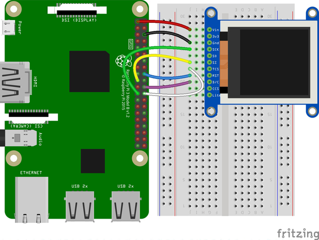

<a name="readme-top"></a>

<!-- ABOUT THE PROJECT -->

# 1. プロジェクトについて

Raspberry Pi の GPIO を使って TFT 液晶ディスプレイ（ST7735）へ表示するプロジェクトです。  
サーボモーター（SG-90）で超音波距離センサー（HC-SR04）を動かしながら、  
周囲の距離を測定し、ディスプレイへ表示します。  
A ボタンを押すと測定開始と終了、C ボタンを押すと画面を再描画します。  
adafruit の「1.8" TFT Display Breakout and Shield / Python Usage」のコードを参考に作成しています。  
参照元のページは下段の「adafruit Python Usage」から確認できます。


本プロジェクトでは以下のパネルをサポートしています。

| ST7735 128x160                                    |
| ------------------------------------------------- |
|  |

<p align="right">(<a href="#readme-top">back to top</a>)</p>

# 2. Pin connections

- CLK connects to SPI clock. On the Raspberry Pi, thats SLCK
- MOSI connects to SPI MOSI. On the Raspberry Pi, thats also MOSI
- CS connects to our SPI Chip Select pin. We'll be using CE0
- D/C connects to our SPI Chip Select pin. We'll be using GPIO 25, but this can be changed later.
- RST connects to our Reset pin. We'll be using GPIO 24 but this can be changed later as well.
- Vin connects to the Raspberry Pi's 3V pin
- GND connects to the Raspberry Pi's ground



| TFT       | RasPi |     | BTN | RasPi |
| --------- | ----- | --- | --- | ----- |
| LED       | 3.3v  |     | A   | GP5   |
| SCK       | GP11  |     | B   | -     |
| SDI(MOSI) | GP10  |     | C   | GP6   |
| DC        | GP25  |     | GND | GND   |
| RESET     | GP24  |     |     |       |
| CS        | GP8   |     |     |       |
| GND       | GND   |     |     |       |
| VCC       | 3V3   |     |     |       |


| HC-SR04 | RasPi |     | SG-90 | RasPi |
| ------- | ----- | --- | ----- | ----- |
| VCC     | 5v    |     | SIG   | GP12  |
| Trig    | GP15  |     | 5v    | 5v    |
| Echo    | GP14  |     | GND   | GP6   |
| GND     | GND   |     |       |       |

<p align="right">(<a href="#readme-top">back to top</a>)</p>

# 3. 環境構築

## 3.1. ライブラリインストール

```Shell
sudo apt update
sudo apt upgrade
sudo apt install python3-pip
sudo pip3 install adafruit-circuitpython-rgb-display
sudo apt install python3-pil
```

インストールしたライブラリの確認。

```Shell
python3
import PIL
import adafruit_rgb_display
```

エラーが出なければ完了です。

## 3.2. プログラムの実行

1. 適当なフォルダへ main.py をコピー
1. > python main.py
1. 背景が表示されます。
1. A ボタンを押すとサーボモーターが動き、超音波距離センサーが測定した距離をディスプレイへ表示します。

# 4. 参考

- [Raspberry Pi hardware](https://www.raspberrypi.com/documentation/computers/raspberry-pi.html)
- [adafruit Python Wiring and Setup](https://learn.adafruit.com/1-8-tft-display/python-wiring-and-setup)
- [adafruit Python Usage](https://learn.adafruit.com/1-8-tft-display/python-usage)
- [RaspberryPi で 1.8" TFT 液晶へ画像を表示](https://qiita.com/wy0727_betch/items/1da0208120adb98f7981)
- [HC-SR04 Ultrasonic Sensor on Raspberry Pi](https://github.com/alaudet/hcsr04sensor/tree/master)

## 4.1. 画像


<p align="right">(<a href="#readme-top">back to top</a>)</p>
