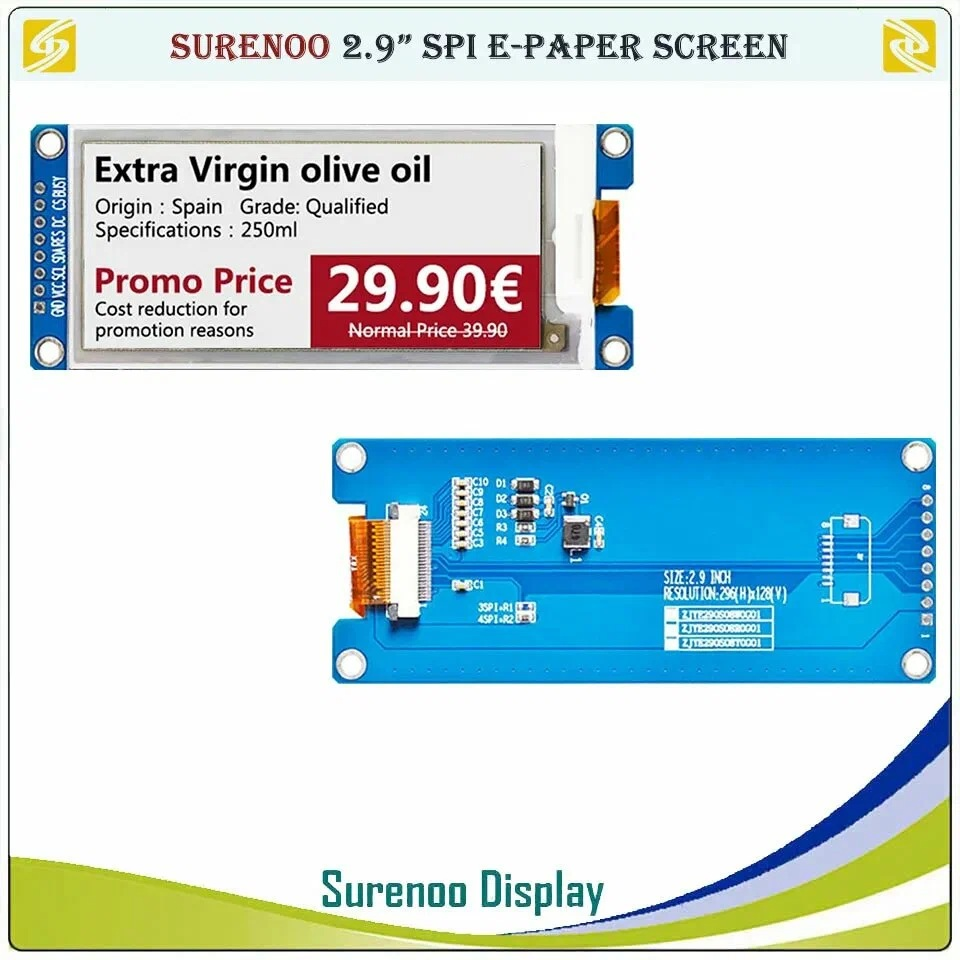
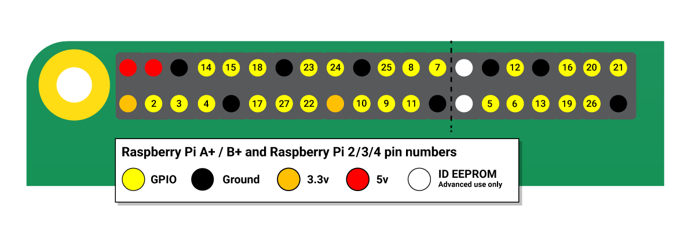
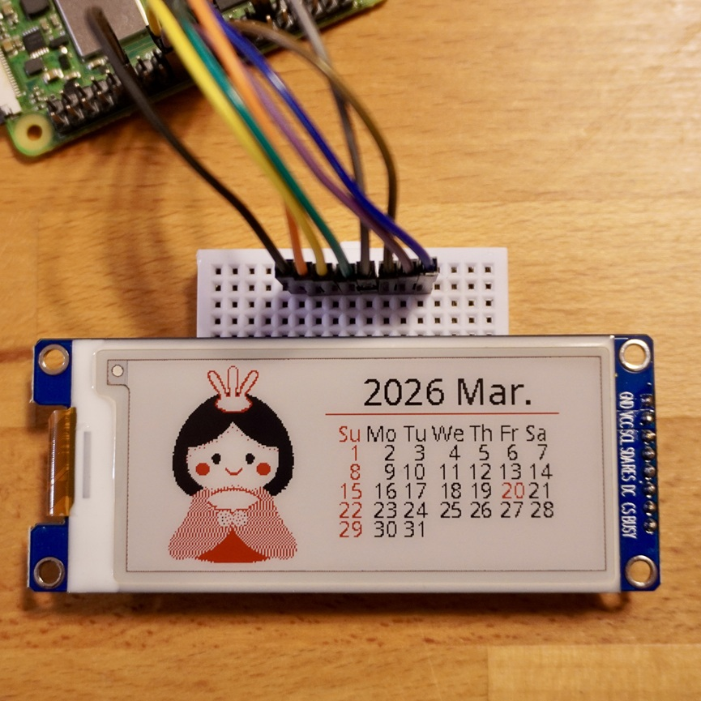

<a name="readme-top"></a>

<!-- ABOUT THE PROJECT -->

# 1. プロジェクトについて

Raspberry Pi Zero 2 Wの GPIO を使って電子ペーパー「SURENOO E-paper 2.9Inch」へ表示するプロジェクトです。

- SURENOO E-paper 2.9Inch 296x128  
  

Waveshare から提供されている e-Paper のサンプルコード「epd2in9b_V4」をベースに作成しています。

- waveshare / e-Paper  
  https://github.com/waveshareteam/e-Paper/tree/master/RaspberryPi_JetsonNano/python

使い方は readme_rpi_EN.txt に記載されていますので確認ください。
サンプルコードのパスは以下です。環境構築後に実行すればテストが実行されます。

```
RaspberryPi_JetsonNano/python/examples/epd_2in9b_V4_test.py
```

<p align="right">(<a href="#readme-top">back to top</a>)</p>

# 2. Pin connections

| e-Paper | RPI(BCM)     |
| ------- | ------------ |
| GND     | Ground       |
| VCC     | 3v3 power    |
| SCL     | GPIO11(SCLK) |
| SDA     | GPIO10(MOSI) |
| RES     | GPIO17       |
| DC      | GPIO25       |
| CS      | GPIO8(CE0)   |
| BUSY    | GPIO24       |

  


<p align="right">(<a href="#readme-top">back to top</a>)</p>

# 3. 環境構築

## 3.1. ライブラリインストール

```Shell
$ sudo apt-get update
$ sudo apt-get install python-pip
$ sudo apt-get install python-pil
$ sudo pip install RPi.GPIO
```

or

```Shell
$ sudo apt-get update
$ sudo apt-get install python3-pip
$ sudo apt-get install python3-pil
$ sudo pip3 install RPi.GPIO
```

エラーが出なければ完了です。

プログラムを実行します。

1. 「E-paper_Program」フォルダを任意のフォルダへコピー
2. 「E-paper_Program/examples」へ移動
3. 公式のサンプルプログラムを実行
   1. `$ python3 epd_2in9b_V4_test.py`
4. カレンダーを表示
   1. `$ epd_2in9b_V4_calendar.py`

うまくいかない場合ですが epdconfig.py で gpiozero を使用していますので以下もお試しください。

```Shell
$ sudo apt update
$ sudo apt install python3-gpiozero
```

使用するRaspberry Pi や Pi Zero のバージョンにより、必要なライブラリが違いますので、参考のManualも参照ください。

<p align="right">(<a href="#readme-top">back to top</a>)</p>

# 4. 減色処理

画像を表示するには、赤や黒にしたい場所を白にしたビットマップ画像を作成する必要があります。  
sample フォルダの color_reduction.py を実行すると、同フォルダにある sample.bmp が 2 色に減色されますので、お試しください。表示する前にイメージが確認できます。

<p align="right">(<a href="#readme-top">back to top</a>)</p>

# 5. 参考

電子ペーパーについてもっと知りたい方は、2つ目の Manual を参照ください。

- [Raspberry Pi hardware](https://www.raspberrypi.com/documentation/computers/raspberry-pi.html)
- [2.9inch e-Paper Module (B) Manual](<https://www.waveshare.com/wiki/2.9inch_e-Paper_Module_(B)_Manual#Working_With_Raspberry_Pi>)

# 6. 画像



<p align="right">(<a href="#readme-top">back to top</a>)</p>
