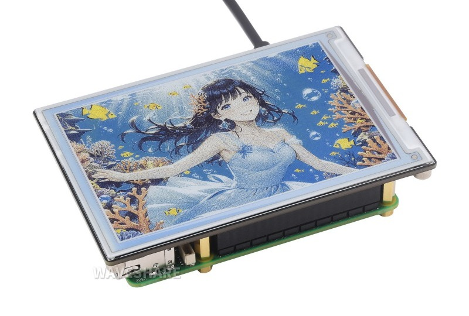

<a name="readme-top"></a>

<!-- ABOUT THE PROJECT -->

# 1. プロジェクトについて

Raspberry Pi の GPIO を使って 4 インチフルカラーの電子ペーパー「4inch e-Paper HAT+ (E)」へ画像を表示するプロジェクトです。

- 4inch e-Paper HAT+ (E)
  

Waveshare から提供されている e-Paper のサンプルコード「4inch_e-Paper_E」をベースに作成しています。

- waveshare / e-Paper  
  https://github.com/waveshare/e-Paper

サンプルコードのパスは以下です。環境構築後に実行すればテストが実行されます。

```
e-Paper/E-paper_Separate_Program/4inch_e-Paper_E/RaspberryPi_JetsonNano/python/examples/epd_4in0e_test.py
```

<p align="right">(<a href="#readme-top">back to top</a>)</p>

# 2. 環境構築

公式の Raspberry Pi の環境構築手順は以下に記載されています。Python を参照すれば良いです。

- [Working With Raspberry Pi](<https://www.waveshare.com/wiki/4inch_e-Paper_HAT%2B_(E)_Manual#Working_With_Raspberry_Pi>)

「Download the demo via GitHub」以降はオリジナルのソースコードを使用する場合に必要な手順です。

とりあえず実行したい場合は、ターミナルを起動して以下のコマンドを順に入力ください。

## 2.1. ライブラリインストール

SPI Interface を有効にします。

```Shell
$ sudo raspi-config
Choose Interfacing Options -> SPI -> Yes Enable SPI interface
$ sudo reboot
```

ライブラリをインストールします。

```Shell
$ sudo apt-get update
$ sudo apt-get install python3-pip
$ sudo apt-get install python3-pil
$ sudo apt-get install python3-numpy
$ sudo apt install python3-spidev
$ sudo apt install python3-gpiozero
```

プログラムを実行します。

1. 「E-paper_Separate_Program」フォルダを任意のフォルダへコピー
2. 「/E-paper_Separate_Program/examples」へ移動
3. 公式のサンプルプログラムを実行
   1. `$ python3 epd_4in0e_test.py `
4. 「pic/sample01.bmp」画像を表示
   1. `$ python3 sample.py `

# 3. 参考

- [Raspberry Pi Getting started](https://www.raspberrypi.com/documentation/computers/getting-started.html)
- [4inch e-Paper HAT+ (E)](https://www.waveshare.com/4inch-e-paper-hat-plus-e.htm)
- [4inch e-Paper HAT+ (E) Manual](<https://www.waveshare.com/wiki/4inch_e-Paper_HAT%2B_(E)>)

# 4. 画像


<p align="right">(<a href="#readme-top">back to top</a>)</p>
