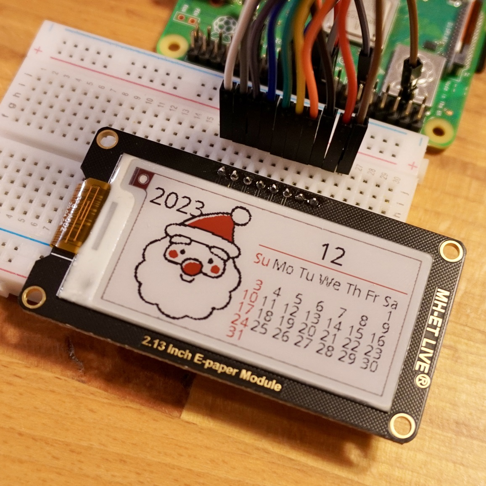

<a name="readme-top"></a>

<!-- ABOUT THE PROJECT -->

# 1. プロジェクトについて

Raspberry Pi の GPIO を使って 電子ペーパー MH-ET LIVE E-paper 2.13 Inch へ表示するプロジェクトです。

- MH-ET LIVE E-paper 2.13 Inch 212x104  
  

Waveshare から提供されている e-Paper のサンプルコード epd2in13b_V4 をベースに作成しています。

- waveshare / e-Paper  
  https://github.com/waveshare/e-Paper

使い方は readme_rpi_EN.txt に記載されていますので確認ください。

<p align="right">(<a href="#readme-top">back to top</a>)</p>

# 2. Pin connections

| EPD  | RPI(BCM)        |
| ---- | --------------- |
| VCC  | 3.3             |
| GND  | GND             |
| DIN  | GP10(SPI0_MOSI) |
| CLK  | GP11(SPI0_SCK)  |
| CS   | GP8(SPI0_CS0)   |
| DC   | GP25            |
| RST  | GP17            |
| BUSY | GP24            |

<p align="right">(<a href="#readme-top">back to top</a>)</p>

# 3. 環境構築

## 3.1. ライブラリインストール

```Shell
$ sudo apt-get update
$ sudo apt-get install python-pip
$ sudo apt-get install python-pil
$ sudo pip install RPi.GPIO
```

or

```Shell
$ sudo apt-get update
$ sudo apt-get install python3-pip
$ sudo apt-get install python3-pil
$ sudo pip3 install RPi.GPIO
```

エラーが出なければ完了です。  
配線後 epd_2in13b_V4_test.py でテストができます。

# 4. 参考

- [Raspberry Pi hardware](https://www.raspberrypi.com/documentation/computers/raspberry-pi.html)
- [2.13inch e-Paper HAT (B) Manual](<https://www.waveshare.com/wiki/2.13inch_e-Paper_HAT_(B)_Manual>)

# 5. 画像



<p align="right">(<a href="#readme-top">back to top</a>)</p>
